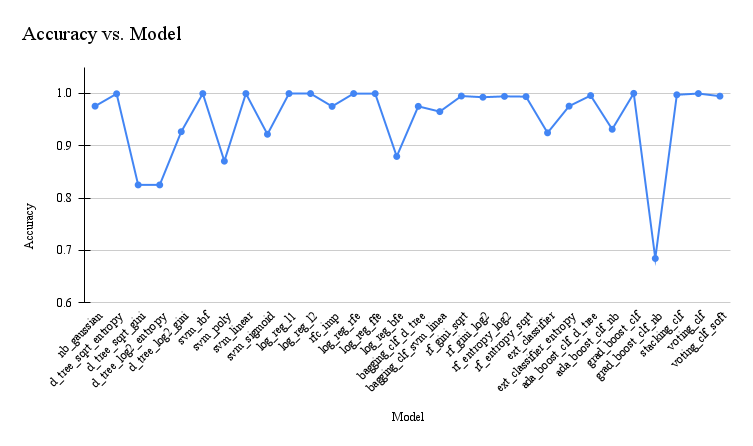
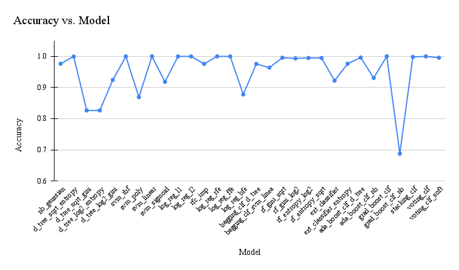
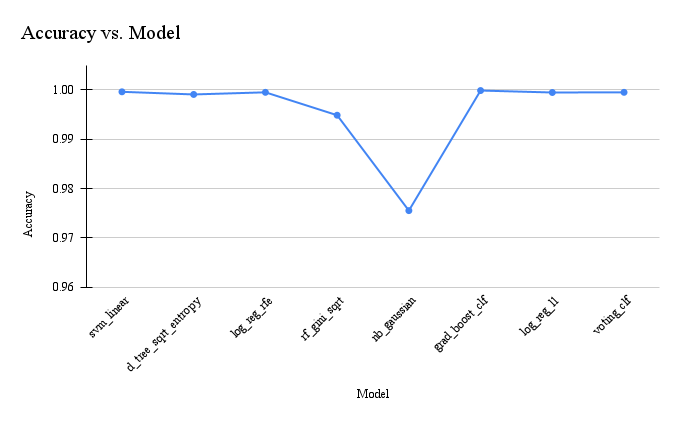
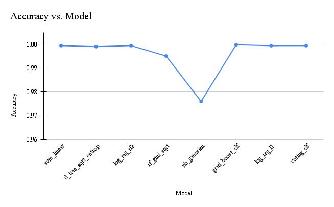

<h1 align="center">Intrusion Detection System</h1>

## Inspiration

 In the existing digital era, Internet and computer systems have increased innumerable security issues due to the volatile use of networks. As the digital world is emerging into society, new stuff like viruses and worms are being imported. The malignant users use different techniques like cracking of passwords, detecting unencrypted text is used to cause vulnerabilities to the system. Hence security is required for the users to secure their systems from intruders. The firewall technique is one of the well-known protection techniques and it is used to protect the private network from the public network. Firewalls filter the incoming traffic from the Internet to evade the firewall. For example, external users can connect to the Intranet by dialing through a modem installed in the private network of the organization, this kind of access cannot be detected by the firewall. Hence to tackle this problem a novel system has to created that would allow us to detect these network attacks, this system is also known as a Network Intrusion detection system (IDS).

## What it does

In this project we have developed an Intrusion Detection System using Machine Learning, that would specify whether there is an Intrusion or not. Multiple models have been developed using sklearn and ensemble techniques which have very good accuracy. 

## How I built it

Python and UNSW-NB15 Dataset.

## Challenges we ran into

The main challenge was to prepare a dataset from the huge amount of data and to select an appropriate method for handling missing values, along with to reducing features using the proper methods. 

## Accomplishments that we are proud of

We are proud that we have successfully managed to build multiple ML models givng high accuracy. Along with accuracy we have also analysed other metrics like precison, recall and fl-score. The best accuracy was giving by Gradient Bossting Algoritm which is 99.98%.

## What's next for Intrusion Detection System

In future we would like deploy the model and integrate with hardware so that it can monitor the network in real time.

## Link for Dataset

https://research.unsw.edu.au/projects/unsw-nb15-dataset 

## Results

Training Accuracy of all Algorithms

Testing Accuracy of all Algorithms

  

Models of highest training accuracy of each type

  

Models of highest testing accuracy of each type
 

## Contributers

| Name          | E-mail |
| ------------- | ------------- |
| Suhas Kadu  |  suhas.kadu19@vit.edu   |
| Kushal Kela  | kushal.kela19@vit.edu  |
| Saket Kolpe  | saket.kolpe19@vit.edu   |
| Chetan Lohkare  | chetan.lohkare19@vit.edu  |

